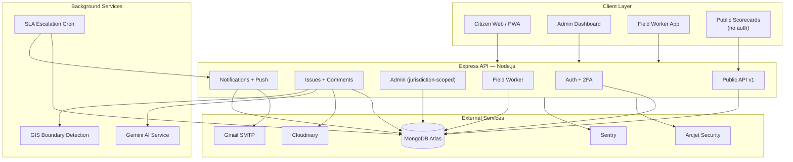

<div align="center">

# NepalSewa

**An AI-powered civic issue reporting platform connecting citizens to their municipalities.**

[](https://nodejs.org/)
[](https://react.dev/)
[](https://www.mongodb.com/atlas)
[](https://expressjs.com/)
[](#license)
[](#testing--ci)

[Live Demo](https://nepalsewa.vercel.app/) · [Backend API](https://smartnepal.onrender.com) · [API Docs](https://smartnepal.onrender.com/api/docs) · [GitHub Repo](https://github.com/Unish4/NepalSewa)

</div>

---

## Overview

**NepalSewa** lets citizens report civic problems — broken roads, garbage, water issues, faulty street lighting, illegal construction — in seconds, with a photo and a map pin. Reports are automatically categorized by AI, routed to the correct municipality based on real geographic boundaries, and tracked through a full resolution lifecycle: verification, field dispatch, resolution, and public accountability.


> NepalSewa is a demonstration/portfolio project. It is not currently deployed for or affiliated with any government of Nepal.

---

## Table of Contents

- [Key Features](#key-features)
- [Tech Stack](#tech-stack)
- [Architecture](#architecture)
- [Getting Started](#getting-started)
- [Environment Variables](#environment-variables)
- [Project Structure](#project-structure)
- [API Documentation](#api-documentation)
- [Testing & CI](#testing--ci)
- [Deployment](#deployment)
- [Known Limitations](#known-limitations)
- [Contributing](#contributing)
- [License](#license)

---

## Key Features

###  For Citizens

| Feature                         | Description                                                                                                                                                            |
| ------------------------------- | ---------------------------------------------------------------------------------------------------------------------------------------------------------------------- |
| **Guided issue reporting**      | A 3-step wizard — details, photo, location — with drag-and-drop upload and click-to-pin mapping                                                                        |
| **AI-assisted triage**          | Google Gemini suggests category and priority from your description, generates a title if you're stuck, and warns you if a similar issue was already reported nearby    |
| **Live geolocation**            | Click-to-pin map (React Leaflet + OpenStreetMap), reverse geocoding via Nominatim, and automatic province/district/ward detection via MongoDB GeoJSON boundary queries |
| **Community engagement**        | Upvote reports to signal urgency, discuss issues in comment threads, earn reputation badges (Verified Reporter, Community Pillar, Trusted Voice, and more)             |
| **Multi-channel notifications** | In-app notification center, Web Push, and email — each individually toggleable, in English or Nepali |
| **Bilingual interface**         | Full English / नेपाली (Devanagari) localization across every citizen-facing page and every notification channel                                                        |
| **Offline-first PWA**           | Installable app; browse cached issues and **submit new reports while offline** — they queue locally and sync automatically the moment connectivity returns             |
| **Public transparency**         | Browse per-municipality scorecards — resolution rate, average response time, category breakdown — with no login required                                               |
| **Live issue heatmap**          | A real density heatmap of civic issues across Nepal, filterable by category, status, and time range                                                                    |

###  For Municipal Administrators

| Feature                        | Description                                                                                                                                                                                        |
| ------------------------------ | -------------------------------------------------------------------------------------------------------------------------------------------------------------------------------------------------- |
| **Jurisdiction-scoped access** | Admins see and act on only their assigned province/district. A `super_admin` tier retains full national oversight                                                                                  |
| **SLA & escalation engine**    | Every issue gets a computed deadline based on priority and category (with tighter windows for safety-critical categories); an hourly sweep auto-escalates overdue issues to the responsible admins |
| **Field dispatch**             | Assign issues to jurisdiction-matched field crews; track assignment, in-progress, and resolution status end-to-end                                                                                 |
| **Audit log**                  | Every status change, assignment, and account action is recorded with actor, timestamp, and jurisdiction — scoped the same way live data is                                                         |
| **Analytics dashboard**        | Recharts-powered breakdowns by category, status, priority, resolution time, and **resolution cost tracking (NPR)**                                                                                 |
| **Reporting exports**          | One-click CSV and PDF exports of filtered issue data for reporting up to district/provincial government                                                                                            |
| **Two-factor authentication**  | TOTP-based 2FA (Google Authenticator–compatible) with backup codes, **mandatory** for every admin-tier and field-worker account                                                                    |

###  For Field Workers

| Feature                         | Description                                                                                            |
| ------------------------------- | ------------------------------------------------------------------------------------------------------ |
| **Mobile-first dispatch app**   | A dedicated, bottom-tab-bar interface built for on-the-go crews, separate from the desktop admin panel |
| **Priority-sorted assignments** | Assigned issues surface most-urgent-first, not just newest-first                                       |
| **Verified resolution**         | Marking an issue resolved requires at least one proof photo — no silent status changes                 |
| **Offline field maps**          | Pre-download map tiles for an entire assigned district before heading into low-connectivity areas      |
| **Cost logging**                | Record the real cost of a resolution for municipal budget tracking                                     |

###  Platform, Security & Infrastructure

- **Defense-in-depth security** — Arcjet-powered bot detection, disposable-email blocking, and WAF shielding layered on top of `express-rate-limit`, all fail-open so a third-party outage never blocks citizens from reporting
- **Encrypted 2FA secrets** — AES-256-GCM at rest, never stored as plaintext or a reversible hash
- **Structured observability** — Pino JSON logging + Sentry error monitoring across both frontend and backend
- **Automated test suite** — Vitest + Supertest + in-memory MongoDB on the backend, Vitest + React Testing Library on the frontend, including dedicated `axe-core` accessibility tests
- **CI/CD merge gate** — GitHub Actions runs the full suite and a production build on every pull request; branch protection makes merging impossible until both pass
- **Full-text search** — MongoDB Atlas Search with automatic `$regex` fallback when unconfigured (e.g., in local development or test environments)
- **Documented, versioned public API** — a rate-limited, read-only `/api/public/v1/*` surface for journalists, researchers, and third-party civic tools, with interactive Swagger docs
- **WCAG accessibility pass** — keyboard focus management, focus trapping in modals, skip-to-content navigation, reduced-motion support, and screen-reader labeling, enforced going forward by automated tests

---

## Tech Stack

<table>
<tr>
<td valign="top" width="50%">

**Frontend**

- React 18 + Vite
- Tailwind CSS v4
- React Router DOM
- Zustand (state management)
- React Hook Form
- Axios
- React Leaflet + OpenStreetMap + `leaflet.heat`
- Recharts
- i18next (English / Nepali)
- Vite PWA + custom Workbox service worker
- IndexedDB (`idb-keyval`) for offline queueing

</td>
<td valign="top" width="50%">

**Backend**

- Node.js + Express 5
- MongoDB + Mongoose (Atlas)
- JWT in httpOnly cookies
- Multer + Cloudinary (image storage)
- Nodemailer (Gmail SMTP)
- Google Gemini API (AI categorization)
- Arcjet (bot detection, rate limiting, WAF)
- `otplib` + `qrcode` (TOTP 2FA)
- `web-push` (Web Push notifications)
- Pino (logging) + Sentry (error monitoring)
- `node-cron` (SLA escalation sweeps)
- `pdfkit` (PDF report generation)
- Swagger UI (`/api/docs`)

</td>
</tr>
</table>

**Infrastructure:** Vercel (frontend) · Render (backend) · MongoDB Atlas · Cloudinary · GitHub Actions (CI/CD)

---

## Architecture



**Key architectural decisions:**

- **Jurisdiction scoping is enforced server-side at the query level**, not filtered client-side — a single middleware (`scopeToMunicipality`) injects the correct MongoDB filter into every admin request.
- **Every optional third-party integration fails open.** If Gmail, Arcjet, Sentry, or Atlas Search is unconfigured, the app degrades gracefully rather than breaking — verified by dedicated tests.
- **AI and GIS enrichment run fire-and-forget** after issue creation, so a slow or unavailable third-party API never blocks a citizen's report from being submitted.
- **`app.js` and `server.js` are split** so the Express app can be imported directly by the test suite (via Supertest) without binding a real network port.

---

## Getting Started

### Prerequisites

- Node.js 20+
- A [MongoDB Atlas](https://www.mongodb.com/atlas) cluster (free tier is sufficient)
- A [Cloudinary](https://cloudinary.com/) account
- A [Google AI Studio](https://aistudio.google.com/) API key (Gemini)
- (Optional but recommended) Accounts for Gmail SMTP, Arcjet, and Sentry — the app runs without them, with reduced functionality

### Installation

```bash
# Clone the repository
git clone https://github.com/Unish4/NepalSewa.git
cd NepalSewa

# Install backend dependencies
cd backend
npm install

# Install frontend dependencies
cd ../frontend
npm install
```

### Environment Variables

Create `backend/.env`:

```env
# Required
NODE_ENV=development
PORT=3000
MONGODB_URI=mongodb+srv://<user>:<pass>@cluster.mongodb.net/nepalsewa
CLIENT_URL=http://localhost:5173
JWT_SECRET=<a long random string>
CLOUDINARY_CLOUD_NAME=
CLOUDINARY_API_KEY=
CLOUDINARY_API_SECRET=
GEMINI_API_KEY=
TOTP_ENCRYPTION_KEY=<64-char hex string — see note below>

# Optional — the app runs without these, with reduced functionality
GMAIL_USER=
GMAIL_APP_PASSWORD=
ARCJET_KEY=
SENTRY_DSN=
VAPID_PUBLIC_KEY=
VAPID_PRIVATE_KEY=
VAPID_SUBJECT=mailto:you@example.com
ATLAS_SEARCH_ENABLED=false
ATLAS_SEARCH_INDEX=
```

> **Generate `TOTP_ENCRYPTION_KEY`:**
>
> ```bash
> node -e "console.log(require('crypto').randomBytes(32).toString('hex'))"
> ```
>
> This key encrypts two-factor authentication secrets at rest. Losing it after admin accounts have enabled 2FA will make those accounts' 2FA unrecoverable — store it securely.

Create `frontend/.env`:

```env
VITE_API_URL=http://localhost:3000
```

### Running Locally

```bash
# Terminal 1 — backend
cd backend
npm run dev

# Terminal 2 — frontend
cd frontend
npm run dev
```

Visit `http://localhost:5173`.

### Seeding Reference Data

```bash
cd backend
npm run seed:boundaries   # Loads Nepal province/district GeoJSON boundaries — required for GIS detection, jurisdiction scoping, scorecards, and offline maps to function
```

### Creating Your First Admin

There is no self-service admin registration. Register a normal account, then either:

1. Promote it manually via MongoDB Atlas (`role: "super_admin"`), **or**
2. Use an existing `super_admin` account's **Admin Accounts** panel to create jurisdiction-scoped admins going forward.

---

## Project Structure

```
NepalSewa/
├── backend/
│   ├── server.js                   # Entry point — starts the HTTP server & cron jobs
│   └── src/
│       ├── app.js                  # Express app (imported directly by tests)
│       ├── config/                 # env, db, cloudinary, arcjet, logger, openapi spec
│       ├── models/                 # Mongoose schemas
│       ├── controllers/            # Route handlers
│       ├── routes/                 # Express routers
│       ├── middleware/             # auth, jurisdiction scoping, 2FA gate, Arcjet guards
│       ├── services/               # AI, GIS, notifications, push, escalation, badges
│       ├── jobs/                   # Scheduled cron tasks
│       └── utils/                  # Validators, token/crypto helpers, query builders
│   └── tests/                      # Vitest + Supertest integration tests
│
├── frontend/
│   └── src/
│       ├── pages/                  # Route-level pages (citizen, admin, field, public)
│       ├── components/             # Reusable UI, layout, and feature components
│       ├── store/                  # Zustand state stores
│       ├── services/                # API client functions
│       ├── hooks/                  # Custom React hooks
│       ├── i18n/                   # English / Nepali translation bundles
│       ├── lib/                    # Axios instance, offline queue, tile math, etc.
│       └── sw.js                   # Custom service worker (push + offline caching)
│   └── tests/                      # Vitest + Testing Library + axe-core a11y tests
│
└── .github/workflows/ci.yml        # CI pipeline (test + build on every PR)
```

---

## API Documentation

Interactive OpenAPI 3.0 documentation is served directly by the running backend:

- **Swagger UI:** `GET /api/docs`
- **Raw spec (JSON):** `GET /api/openapi.json`

### Public API

A subset of the API requires no authentication at all and is safe for external tools, researchers, and journalists to consume directly:

**Versioned v1 endpoints:**
```
GET /api/public/v1/issues            # List public issue data (filterable, max page size 25)
GET /api/public/v1/issues/:id        # Single issue detail
GET /api/public/v1/categories        # Valid issue categories
GET /api/public/v1/stats             # Nationwide platform statistics
```

**Unversioned / legacy scorecard endpoints:**
```
GET /api/public/scorecard/:province/:district?   # Per-municipality transparency scorecard
GET /api/public/scorecard-directory  # Every municipality with reported issues
```

All public routes are rate-limited via Arcjet and return only aggregate or already-public data — no citizen contact information is ever exposed.

---

## Testing & CI

```bash
# Backend — Vitest + Supertest + in-memory MongoDB
cd backend
npm test              # run once
npm run test:watch    # watch mode
npm run test:coverage # with coverage report

# Frontend — Vitest + React Testing Library + jest-axe
cd frontend
npm test
```

Every pull request automatically runs the full backend and frontend test suites plus a production build via **GitHub Actions**. Branch protection on `main` requires both checks to pass before a merge is permitted — see [`.github/workflows/ci.yml`](.github/workflows/ci.yml).

---

## Deployment

| Component | Platform                                       | Notes                                                                |
| --------- | ---------------------------------------------- | -------------------------------------------------------------------- |
| Frontend  | [Vercel](https://nepalsewa.vercel.app/)        | Root directory: `frontend` · Build: `npm run build` · Output: `dist` |
| Backend   | [Render](https://smartnepal.onrender.com)      | Root directory: `backend` · Start: `node server.js`                  |
| Database  | [MongoDB Atlas](https://www.mongodb.com/atlas) | Network access must allow Render's IPs (`0.0.0.0/0` on free tier)    |
| Images    | [Cloudinary](https://cloudinary.com)           | —                                                                    |

After deploying both services, set `CLIENT_URL` (Render) and `VITE_API_URL` (Vercel) to point to each other's live URLs, and add `frontend/vercel.json` to correctly handle client-side routing on refresh.


## Known Limitations

Being transparent about the current state of the project:

- **Notification content (in-app + push) is currently English-only**, even for citizens with a Nepali language preference — email notifications are fully bilingual, but the other two channels haven't caught up yet.

- Some newer auth flows (password reset, 2FA setup) are not yet localized into Nepali.

Contributions addressing any of the above are especially welcome.

---

## Contributing

Contributions are welcome. Please:

1. Fork the repository and create a feature branch (`git checkout -b feature/your-feature`)
2. Make your changes, **including test coverage** — the CI pipeline will not allow a merge without passing tests
3. Run `npm test` in both `backend/` and `frontend/` before opening a PR
4. Open a pull request describing your change

Please open an issue first for any large or breaking change so it can be discussed.

---

## License

Distributed under the MIT License. See `LICENSE` for details.

---

<div align="center">

Built for Nepal 

</div>
